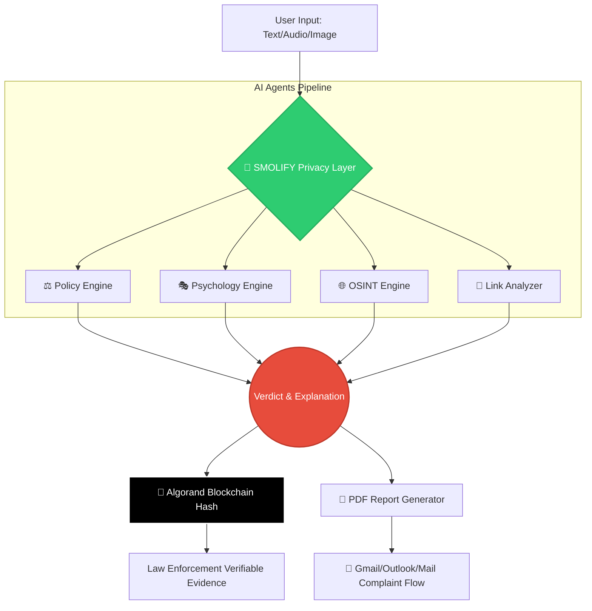

<div align="center">

# 🚨 **TARK** 
**Threat Analysis & Response Knowledgebase**

[](https://opensource.org/licenses/MIT)
[](https://www.algorand.com/)
[](https://github.com/your-repo)
[](#-smolify--privacy-first-ai-layer)

<br>


### *A multi-agent AI pipeline that detects, analyzes, explains, and reports cyber scams — backed by privacy-first architecture and immutable blockchain evidence.*

[Architecture](#-system-architecture) • [Innovations](#-key-innovations) • [Smolify](#-why-smolify)  • [Agorand](#-algorand)

</div>

---

## 🔍 The Problem

Cyber scams are evolving at terrifying speeds. Phishing, impersonation, KYC fraud, and voice scams are all designed to exploit **human psychology**. Existing "AI" solutions fail because:

- ❌ **They rely on generic LLMs** (resulting in generic, unhelpful answers).
- ❌ **They lack multi-modal understanding** (unable to cross-reference text, audio, and images).
- ❌ **They ignore critical privacy concerns** (leaking PII to the cloud).
- ❌ **They don't produce actionable outputs** (useless for law enforcement).

---

## 💡 The TARK Solution

TARK is not just a chatbot; it is a **Specialized Cyber Defense Ecosystem**. By layering specialized AI agents rather than relying on a single, general-purpose LLM, TARK delivers law-enforcement-ready intelligence.

### 🧠 The Multi-Agent Pipeline
Instead of asking one AI to do everything, TARK splits the workload:
* **⚖️ Policy Engine:** Validates inputs against strict rule-based scam heuristics.
* **🎭 Psychology Agent:** Detects manipulative intent (urgency, fear, greed).
* **🌐 OSINT Engine:** Matches real-world scam patterns from live threat intelligence.
* **🔗 Link Analysis Engine:** Deep-scans URLs for phishing and malicious payloads.
* **📄 Report Generator:** Compiles findings into legally actionable evidence.

---

## ⚙️ System Architecture

*TARK processes threats through a secure, linear pipeline ensuring no data leakage and maximum analytical depth.*



🤏 Why SMOLIFY Matters
=====

*   🔐 Prevents data leakage to AI models
*   🏠 Runs **locally (no external exposure)**
*   ⚖️ Ensures **compliance & ethical AI usage**
*   🧠 Keeps semantic meaning intact for analysis
    

🤏 Impact
---------

TARK becomes:
> 🔒 **Privacy-first cyber intelligence system**

🔗 ALGORAND — Immutable Evidence Layer
======================================

⛓️ Why Blockchain?
------------------

Cybercrime reporting needs:
*   Tamper-proof evidence
*   Verifiable logs
*   Trust in data authenticity
    

⚡ Our Use of Algorand
---------------------

*   Store **hash of scam data**
*   Generate **transaction ID**
*   Create **immutable proof**
    

🧾 Example
----------
```   
TX ID: XUUKBG7NUMDKA5ZA...
HASH: b8d5561187a74eae...   
```
🚀 Why Algorand?
----------------

*   ⚡ Instant finality
*   💸 Low cost
*   🔐 High security
*   🌍 Scalable
    

🏛️ Impact
----------

> Evidence becomes **court-verifiable**

🧩 Core Features
================

🔍 Scam Analysis (/analyze)
---------------------------

*   Multi-agent pipeline
*   Verdict + confidence
*   Psychology + OSINT breakdown

🔗 Link Safety (/link-safety-check)
-----------------------------------
*   URL extraction
*   Phishing detection
*   Risk flags

📄 Report Generation (/report-generate)
---------------------------------------
*   Professional PDF
*   Cybercrime-ready format
*   Gmail integration for reporting

🧠 Emotional Support Chatbot (/chatbot)
---------------------------------------
*   Helps users after scam trauma
*   Reduces panic & anxiety
*   Guides next steps safely

🔥 Key Innovation
=================

### 💥 Not just detection — FULL PIPELINE

| Stage        | Capability         |
| ------------ | ------------------ |
| Input        | Multi-modal        |
| Privacy      | 🤏 Smolify         |
| Intelligence | Multi-agent        |
| Trust        | Algorand           |
| Output       | Legal-ready report |


🎯 Real-World Impact
====================

*   🏛️ Helps citizens report scams easily
*   🔍 Improves investigation quality
*   ⚖️ Supports legal evidence
*   🔒 Protects user privacy
    

🚀 Future Scope
===============
*   📸 Image scam detection (WhatsApp screenshots)
*   🎙️ Voice threat detection
*   🌐 Global scam intelligence network
*   🧠 Fine-tuned fraud detection models

🏁 Conclusion
=============

> TARK is not just an AI tool.

It is a **complete cyber defense ecosystem** combining
*   🤏 **SMOLIFY → Privacy**
*   🧠 **AI Agents → Intelligence**
*   🔗 **Algorand → Trust**
    

👨‍💻 Built For Hackathon Excellence
====================================

✔ Real-world problem✔ Scalable architecture✔ Ethical AI usage✔ Strong technical depth✔ Clear impact
